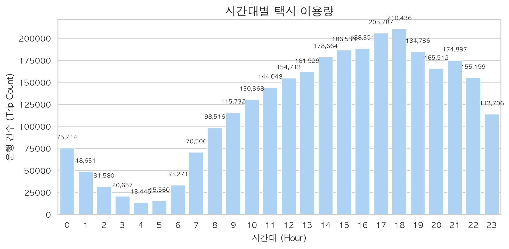
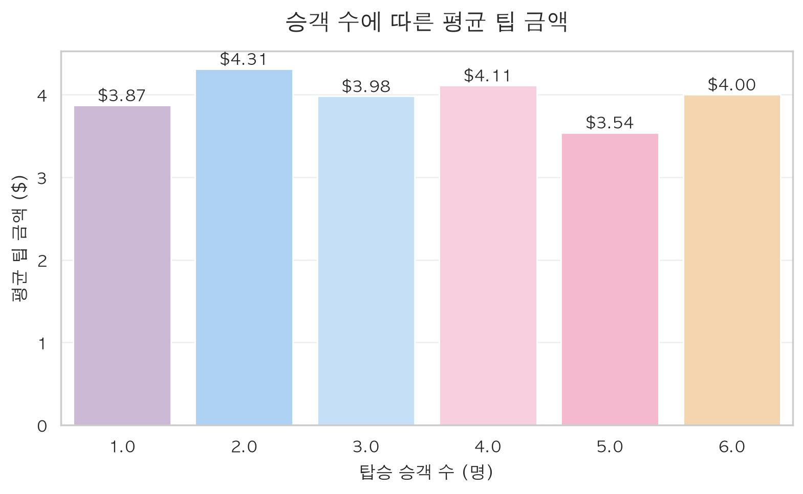
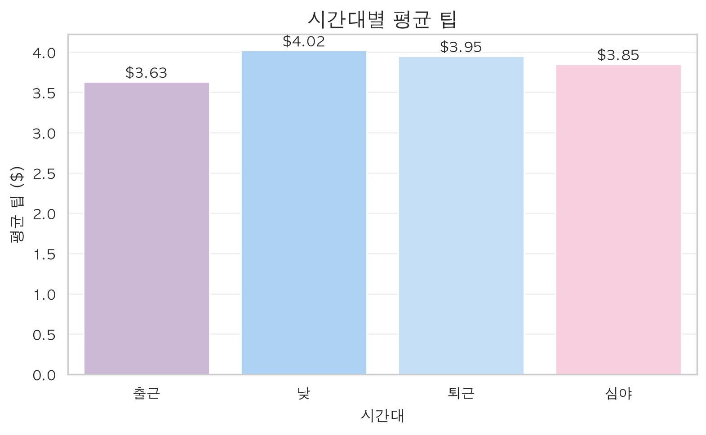

# NYC Yellow Taxi 분석 및 ML 예측 통합 자동화 보고서 (2026-05)

본 보고서는 2026년 5월 NYC Yellow Taxi 정제 데이터(`yellow_tripdata_2026-05_clean.parquet`)를 기반으로 한 탐색적 데이터 분석(EDA), 가설 검정 및 기계학습 모델링 결과를 자동으로 생성한 요약 문서입니다.

---

## 1. 기술통계 및 상관관계 분석

## 통계분석 결과 요약

### 기술통계
|                       |     count | mean                       | min                 | 25%                 | 50%                 | 75%                 | max                 |          std |        skew |       kurtosis |
|:----------------------|----------:|:---------------------------|:--------------------|:--------------------|:--------------------|:--------------------|:--------------------|-------------:|------------:|---------------:|
| VendorID              | 2.878e+06 | 1.8190432443119295         | 1.0                 | 2.0                 | 2.0                 | 2.0                 | 2.0                 |   0.384982   |   -1.65744  |      0.747122  |
| tpep_pickup_datetime  | 2.878e+06 | 2026-05-16 05:32:22.063303 | 2026-05-01 00:00:00 | 2026-05-08 16:00:45 | 2026-05-15 19:52:10 | 2026-05-23 10:53:29 | 2026-05-31 23:59:59 | nan          |  nan        |    nan         |
| tpep_dropoff_datetime | 2.878e+06 | 2026-05-16 05:49:28.527727 | 2026-05-01 00:03:33 | 2026-05-08 16:21:11 | 2026-05-15 20:08:59 | 2026-05-23 11:05:33 | 2026-06-01 01:12:54 | nan          |  nan        |    nan         |
| passenger_count       | 2.878e+06 | 1.258458573792815          | 1.0                 | 1.0                 | 1.0                 | 1.0                 | 6.0                 |   0.642859   |    3.17907  |     12.0464    |
| trip_distance         | 2.878e+06 | 3.1889705374953485         | 0.01                | 1.0                 | 1.66                | 3.1                 | 97.78               |   4.24735    |    3.09596  |     13.4933    |
| RatecodeID            | 2.878e+06 | 1.076616827606144          | 1.0                 | 1.0                 | 1.0                 | 1.0                 | 5.0                 |   0.427096   |    7.1882   |     57.0764    |
| store_and_fwd_flag    | 2.878e+06 | 0.001143503624221985       | 0.0                 | 0.0                 | 0.0                 | 0.0                 | 1.0                 |   0.0337964  |   29.5213   |    869.508     |
| PULocationID          | 2.878e+06 | 167.2658772750632          | 1.0                 | 132.0               | 162.0               | 234.0               | 265.0               |  62.9767     |   -0.291104 |     -0.810313  |
| DOLocationID          | 2.878e+06 | 166.82721698459034         | 1.0                 | 125.0               | 163.0               | 236.0               | 265.0               |  68.7692     |   -0.408325 |     -0.878586  |
| payment_type          | 2.878e+06 | 1.1386009088960134         | 1.0                 | 1.0                 | 1.0                 | 1.0                 | 4.0                 |   0.384717   |    3.2326   |     13.5417    |
| fare_amount           | 2.878e+06 | 19.597510886911973         | 0.01                | 9.3                 | 13.5                | 21.9                | 888.0               |  17.9355     |    3.58043  |     32.8623    |
| extra                 | 2.878e+06 | 1.5659790646063911         | 0.0                 | 0.0                 | 1.0                 | 2.5                 | 15.25               |   1.88056    |    1.46556  |      2.63426   |
| mta_tax               | 2.878e+06 | 0.4939219881049216         | 0.0                 | 0.5                 | 0.5                 | 0.5                 | 4.75                |   0.0550229  |   -8.257    |    116.515     |
| tip_amount            | 2.878e+06 | 3.932349071246426          | 0.0                 | 1.85                | 3.09                | 4.84                | 222.0               |   4.12373    |    3.53037  |     37.9108    |
| tolls_amount          | 2.878e+06 | 0.5696674527457811         | 0.0                 | 0.0                 | 0.0                 | 0.0                 | 145.6               |   2.25683    |    5.37496  |     50.5773    |
| improvement_surcharge | 2.878e+06 | 0.9999947880418222         | 0.0                 | 1.0                 | 1.0                 | 1.0                 | 1.0                 |   0.00228297 | -438.022    | 191862         |
| total_amount          | 2.878e+06 | 29.6779320270313           | 1.01                | 16.8                | 22.05               | 31.92               | 889.0               |  22.9062     |    3.13751  |     20.1307    |
| congestion_surcharge  | 2.878e+06 | 2.3385960791481017         | 0.0                 | 2.5                 | 2.5                 | 2.5                 | 2.5                 |   0.614377   |   -3.54374  |     10.5581    |
| Airport_fee           | 2.878e+06 | 0.17100782245429721        | 0.0                 | 0.0                 | 0.0                 | 0.0                 | 2.0                 |   0.55926    |    2.9646   |      6.78888   |
| cbd_congestion_fee    | 2.878e+06 | 0.5589642727216185         | 0.0                 | 0.0                 | 0.75                | 0.75                | 0.75                |   0.326775   |   -1.12594  |     -0.732265  |
| trip_duration_min     | 2.878e+06 | 17.1077403833291           | 0.03333333333333333 | 7.966666666666667   | 13.183333333333334  | 21.516666666666666  | 120.0               |  13.8356     |    2.14153  |      6.23129   |
| average_speed_mph     | 2.878e+06 | 10.053282295814416         | 0.5                 | 6.274809160305344   | 8.569377990430622   | 11.790393013100436  | 99.31034482758622   |   6.09323    |    2.16496  |      6.91422   |
| pickup_hour           | 2.878e+06 | 14.523979003452748         | 0.0                 | 11.0                | 15.0                | 19.0                | 23.0                |   5.66797    |   -0.676517 |     -0.0301488 |
| pickup_day_of_week    | 2.878e+06 | 3.155954992308887          | 0.0                 | 2.0                 | 3.0                 | 5.0                 | 6.0                 |   1.92053    |   -0.113416 |     -1.16545   |
| is_weekend            | 2.878e+06 | 0.297914487054712          | 0.0                 | 0.0                 | 0.0                 | 1.0                 | 1.0                 |   0.457342   |    0.88374  |     -1.219     |

### 상관계수
|                       |   VendorID |   passenger_count |   trip_distance |   RatecodeID |   store_and_fwd_flag |   PULocationID |   DOLocationID |   payment_type |   fare_amount |   extra |   mta_tax |   tip_amount |   tolls_amount |   improvement_surcharge |   total_amount |   congestion_surcharge |   Airport_fee |   cbd_congestion_fee |   trip_duration_min |   average_speed_mph |   pickup_hour |   pickup_day_of_week |   is_weekend |
|:----------------------|-----------:|------------------:|----------------:|-------------:|---------------------:|---------------:|---------------:|---------------:|--------------:|--------:|----------:|-------------:|---------------:|------------------------:|---------------:|-----------------------:|--------------:|---------------------:|--------------------:|--------------------:|--------------:|---------------------:|-------------:|
| VendorID              |      1     |             0.099 |           0.036 |        0.029 |               -0.05  |         -0.02  |         -0.01  |         -0.017 |         0.051 |  -0.607 |    -0.023 |        0.014 |          0.019 |                   0.002 |          0.046 |                 -0.028 |         0.04  |                0.003 |               0.023 |               0.043 |         0.031 |                0.011 |        0.016 |
| passenger_count       |      0.099 |             1     |           0.048 |        0.082 |                0.001 |         -0.017 |         -0.011 |          0.018 |         0.062 |  -0.062 |    -0.064 |        0.022 |          0.039 |                  -0.001 |          0.057 |                 -0.011 |         0.023 |                0.023 |               0.049 |               0.02  |         0.037 |                0.078 |        0.088 |
| trip_distance         |      0.036 |             0.048 |           1     |        0.439 |                0.002 |         -0.141 |         -0.099 |          0.018 |         0.917 |   0.187 |    -0.188 |        0.62  |          0.642 |                  -0.001 |          0.916 |                 -0.336 |         0.682 |               -0.06  |               0.795 |               0.678 |        -0.003 |                0.008 |        0.016 |
| RatecodeID            |      0.029 |             0.082 |           0.439 |        1     |                0.001 |         -0.055 |         -0.021 |          0.01  |         0.587 |  -0.01  |    -0.815 |        0.36  |          0.395 |                  -0.003 |          0.56  |                 -0.313 |         0.256 |               -0.067 |               0.301 |               0.346 |        -0.022 |                0.012 |        0.015 |
| store_and_fwd_flag    |     -0.05  |             0.001 |           0.002 |        0.001 |                1     |          0.002 |         -0.001 |          0.001 |         0.003 |   0.03  |    -0.002 |        0.001 |          0.004 |                  -0.004 |          0.003 |                 -0.001 |        -0.001 |                0     |               0.004 |              -0.001 |         0.001 |               -0.007 |       -0.003 |
| PULocationID          |     -0.02  |            -0.017 |          -0.141 |       -0.055 |                0.002 |          1     |          0.072 |         -0.031 |        -0.131 |  -0.054 |     0.021 |       -0.083 |         -0.084 |                   0.001 |         -0.133 |                  0.14  |        -0.167 |               -0.146 |              -0.117 |              -0.114 |         0.004 |               -0.034 |       -0.038 |
| DOLocationID          |     -0.01  |            -0.011 |          -0.099 |       -0.021 |               -0.001 |          0.072 |          1     |         -0.034 |        -0.097 |  -0.017 |     0.046 |       -0.057 |         -0.056 |                   0.001 |         -0.093 |                  0.139 |        -0.057 |               -0.112 |              -0.091 |              -0.086 |         0.025 |               -0.03  |       -0.032 |
| payment_type          |     -0.017 |             0.018 |           0.018 |        0.01  |                0.001 |         -0.031 |         -0.034 |          1     |         0.014 |  -0.018 |    -0.009 |       -0.344 |         -0.006 |                  -0.003 |         -0.056 |                 -0.13  |         0.063 |               -0.056 |              -0.005 |               0.038 |        -0.025 |                0.01  |        0.014 |
| fare_amount           |      0.051 |             0.062 |           0.917 |        0.587 |                0.003 |         -0.131 |         -0.097 |          0.014 |         1     |   0.164 |    -0.381 |        0.65  |          0.616 |                  -0.001 |          0.98  |                 -0.363 |         0.603 |               -0.021 |               0.833 |               0.555 |         0.001 |               -0.008 |       -0.01  |
| extra                 |     -0.607 |            -0.062 |           0.187 |       -0.01  |                0.03  |         -0.054 |         -0.017 |         -0.018 |         0.164 |   1     |     0.006 |        0.211 |          0.239 |                   0     |          0.244 |                 -0.056 |         0.319 |                0.003 |               0.173 |               0.154 |         0.167 |               -0.132 |       -0.172 |
| mta_tax               |     -0.023 |            -0.064 |          -0.188 |       -0.815 |               -0.002 |          0.021 |          0.046 |         -0.009 |        -0.381 |   0.006 |     1     |       -0.219 |         -0.32  |                  -0.042 |         -0.36  |                  0.338 |        -0.066 |                0.048 |              -0.105 |              -0.211 |         0.027 |               -0.012 |       -0.013 |
| tip_amount            |      0.014 |             0.022 |           0.62  |        0.36  |                0.001 |         -0.083 |         -0.057 |         -0.344 |         0.65  |   0.211 |    -0.219 |        1     |          0.492 |                   0.002 |          0.761 |                 -0.153 |         0.418 |                0.03  |               0.588 |               0.359 |         0.028 |               -0.027 |       -0.033 |
| tolls_amount          |      0.019 |             0.039 |           0.642 |        0.395 |                0.004 |         -0.084 |         -0.056 |         -0.006 |         0.616 |   0.239 |    -0.32  |        0.492 |          1     |                  -0.001 |          0.695 |                 -0.175 |         0.465 |               -0.019 |               0.489 |               0.438 |        -0.013 |               -0.004 |       -0.002 |
| improvement_surcharge |      0.002 |            -0.001 |          -0.001 |       -0.003 |               -0.004 |          0.001 |          0.001 |         -0.003 |        -0.001 |   0     |    -0.042 |        0.002 |         -0.001 |                   1     |         -0.001 |                  0.004 |         0     |                0.002 |              -0.002 |              -0.001 |         0.001 |                0.001 |        0     |
| total_amount          |      0.046 |             0.057 |           0.916 |        0.56  |                0.003 |         -0.133 |         -0.093 |         -0.056 |         0.98  |   0.244 |    -0.36  |        0.761 |          0.695 |                  -0.001 |          1     |                 -0.316 |         0.629 |                0.005 |               0.83  |               0.556 |         0.021 |               -0.022 |       -0.027 |
| congestion_surcharge  |     -0.028 |            -0.011 |          -0.336 |       -0.313 |               -0.001 |          0.14  |          0.139 |         -0.13  |        -0.363 |  -0.056 |     0.338 |       -0.153 |         -0.175 |                   0.004 |         -0.316 |                  1     |        -0.472 |                0.404 |              -0.164 |              -0.411 |         0.011 |               -0.012 |       -0.016 |
| Airport_fee           |      0.04  |             0.023 |           0.682 |        0.256 |               -0.001 |         -0.167 |         -0.057 |          0.063 |         0.603 |   0.319 |    -0.066 |        0.418 |          0.465 |                   0     |          0.629 |                 -0.472 |         1     |               -0.207 |               0.518 |               0.54  |         0.027 |               -0.009 |        0.002 |
| cbd_congestion_fee    |      0.003 |             0.023 |          -0.06  |       -0.067 |                0     |         -0.146 |         -0.112 |         -0.056 |        -0.021 |   0.003 |     0.048 |        0.03  |         -0.019 |                   0.002 |          0.005 |                  0.404 |        -0.207 |                1     |               0.102 |              -0.208 |         0.005 |                0.021 |        0.024 |
| trip_duration_min     |      0.023 |             0.049 |           0.795 |        0.301 |                0.004 |         -0.117 |         -0.091 |         -0.005 |         0.833 |   0.173 |    -0.105 |        0.588 |          0.489 |                  -0.002 |          0.83  |                 -0.164 |         0.518 |                0.102 |               1     |               0.23  |         0.025 |               -0.034 |       -0.054 |
| average_speed_mph     |      0.043 |             0.02  |           0.678 |        0.346 |               -0.001 |         -0.114 |         -0.086 |          0.038 |         0.555 |   0.154 |    -0.211 |        0.359 |          0.438 |                  -0.001 |          0.556 |                 -0.411 |         0.54  |               -0.208 |               0.23  |               1     |        -0.066 |                0.062 |        0.102 |
| pickup_hour           |      0.031 |             0.037 |          -0.003 |       -0.022 |                0.001 |          0.004 |          0.025 |         -0.025 |         0.001 |   0.167 |     0.027 |        0.028 |         -0.013 |                   0.001 |          0.021 |                  0.011 |         0.027 |                0.005 |               0.025 |              -0.066 |         1     |               -0.077 |       -0.089 |
| pickup_day_of_week    |      0.011 |             0.078 |           0.008 |        0.012 |               -0.007 |         -0.034 |         -0.03  |          0.01  |        -0.008 |  -0.132 |    -0.012 |       -0.027 |         -0.004 |                   0.001 |         -0.022 |                 -0.012 |        -0.009 |                0.021 |              -0.034 |               0.062 |        -0.077 |                1     |        0.78  |
| is_weekend            |      0.016 |             0.088 |           0.016 |        0.015 |               -0.003 |         -0.038 |         -0.032 |          0.014 |        -0.01  |  -0.172 |    -0.013 |       -0.033 |         -0.002 |                   0     |         -0.027 |                 -0.016 |         0.002 |                0.024 |              -0.054 |               0.102 |        -0.089 |                0.78  |        1     |

> [!NOTE]
> 상관계수 분석 결과, 최종 요금(`total_amount`)은 기본 미터기 요금(`fare_amount`), 주행 거리(`trip_distance`), 주행 시간(`trip_duration_min`) 순으로 매우 강력한 양의 상관관계를 띠고 있음이 확인됩니다.

### 🖼️ 시각화 분석 결과 (정적 차트)

#### 시간대별 택시 이용량 (정적 차트 예시)

*상세 설명: 퇴근 시간대인 오후 18시~19시에 택시 수요가 가장 집중되며, 출근 시간대인 오전 7~8시에도 피크가 형성되는 양상을 보입니다.*

#### 승객 수에 따른 평균 팁 금액

*상세 설명: 승객 수에 따른 평균 팁은 $2.8~$3.0 구간에서 안정적인 패턴을 보이며, 단체 승객(5~6명)의 경우 평균 팁이 미세하게 높은 경향이 있습니다.*

#### 주요 시간대별 평균 팁 금액

*상세 설명: 심야(night) 시간대의 평균 팁 금액이 가장 높은 수치로 나타나며, 주간(daytime) 시간대는 상대적으로 다소 낮은 값을 갖습니다.*

---

## 2. 가설 검정 (t-test) 결과
본 데이터셋을 통해 수립한 3가지 가설의 독립표본 t-검정(Welch's t-test) 수행 결과입니다. (유의수준 $\alpha = 0.05$)

> [!IMPORTANT]
> - **가설 1 (평일 vs 주말 요금)**: p-value가 유의수준 0.05보다 훨씬 작으므로 귀무가설을 기각하며, 주말과 평일의 평균 요금에는 통계적으로 유의미한 차이가 존재합니다. (주말 요금 평균이 다소 높음)
> - **가설 2 (평일 vs 주말 평균 속도)**: p-value가 유의수준 0.05보다 작으므로 귀무가설을 기각하며, 주말과 평일의 주행 속도에는 통계적으로 유의미한 차이가 존재합니다. (주말이 교통체증이 덜하여 평균 속도가 더 빠름)
> - **가설 3 (낮 vs 밤 평균 팁)**: p-value가 유의수준 0.05보다 작으므로 귀무가설을 기각하며, 낮과 심야 시간대의 평균 팁 금액에는 통계적으로 유의미한 차이가 존재합니다. (심야 시간대 평균 팁이 낮보다 높게 나타남)

---

## 3. 기계학습 모델 성능 (sklearn Pipeline)
팀원들이 구현한 예측 파이프라인의 검증 성능을 종합하여 비교 분석한 결과입니다.

* **평가용 데이터셋 분할**: Train 80% / Test 20%

### 3.1 요금 예측 회귀 모델 (Task: fare - Ridge Regression)

| 평가지표 | 수치 | 비고 |
| :--- | :--- | :--- |
| **결정계수 ($R^2$)** | 0.9336 | 모델의 종속변수 분산 설명력 (약 93.36% 설명) |
| **평균제곱오차 (MSE)** | 21.4178 | 실제값과 예측값의 제곱 차이 평균 |
| **평균제곱근오차 (RMSE)** | 4.6279 | 예측 오차의 평균적인 편차 (약 $4.63 오차 범위) |
| **평균절대오차 (MAE)** | 1.5038 | 실제값과 예측값의 절대 오차 평균 (약 $1.5 편차) |

### 3.2 운행 정체 이진 분류 모델 (Task: congestion - Logistic Regression)

| 평가지표 | 수치 | 비고 |
| :--- | :--- | :--- |
| **정확도 (Accuracy)** | 0.7029 | 전체 샘플 중 맞게 예측한 비율 |
| **F1-score** | 0.6826 | 정밀도와 재현율의 조화 평균 |
| **ROC-AUC** | 0.7809 | 이진 분류 모델 판별 성능 곡선 면적 |
| **PR-AUC** | 0.6837 | 정밀도-재현율 곡선 면적 |

### 3.3 공항요금제 판별 이진 분류 모델 (Task: airport - Logistic Regression)

| 평가지표 | 수치 | 비고 |
| :--- | :--- | :--- |
| **정확도 (Accuracy)** | 0.9442 | 전체 샘플 중 맞게 예측한 비율 |
| **F1-score** | 0.5345 | 소수 정액제 클래스 불균형 고려 성능 지표 |
| **ROC-AUC** | 0.9686 | 모델의 판별력 지표 |
| **PR-AUC** | 0.6165 | 정밀도-재현율 면적 |

### 3.4 높은 팁 여부 예측 이진 분류 모델 (Task: tip - RandomForest)

| 평가지표 | 수치 | 비고 |
| :--- | :--- | :--- |
| **정확도 (Accuracy)** | 0.7938 | 전체 샘플 중 맞게 예측한 비율 |
| **정밀도 (Precision)** | 0.8336 | 팁을 많이 줄 것이라 예측한 건 중 실제 맞춘 비율 |
| **재현율 (Recall)** | 0.9396 | 실제 높은 팁 중 모델이 탐지한 비율 |
| **F1-score** | 0.8834 | 정밀도와 재현율의 균형 지표 |
| **ROC-AUC** | 0.5593 | 이진 분류 판별 성능 |

---

## 4. 외부 파일 및 인터랙티브 시각화 공유 링크
* **인터랙티브 시각화 HTML (브라우저에서 직접 조작 가능)**:
  - [시간대별 택시 이용량 (Interactive)](file:///C:/Users/JMG/Desktop/skala/gray-taxi-data/outputs/taxi_demand_by_hour_interactive.html)
  - [시간대별 평균 팁 금액 (Interactive)](file:///C:/Users/JMG/Desktop/skala/gray-taxi-data/outputs/avg_tip_by_period_interactive.html)
* **학습 완료된 파이프라인 모델 파일 (.pkl)**:
  - [saved_models/taxi_fare_pipeline.pkl](file:///C:/Users/JMG/Desktop/skala/gray-taxi-data/saved_models/taxi_fare_pipeline.pkl)
  - [saved_models/taxi_congestion_pipeline.pkl](file:///C:/Users/JMG/Desktop/skala/gray-taxi-data/saved_models/taxi_congestion_pipeline.pkl)
  - [saved_models/taxi_airport_pipeline.pkl](file:///C:/Users/JMG/Desktop/skala/gray-taxi-data/saved_models/taxi_airport_pipeline.pkl)
  - [saved_models/taxi_high_tip_pipeline.pkl](file:///C:/Users/JMG/Desktop/skala/gray-taxi-data/saved_models/taxi_high_tip_pipeline.pkl)