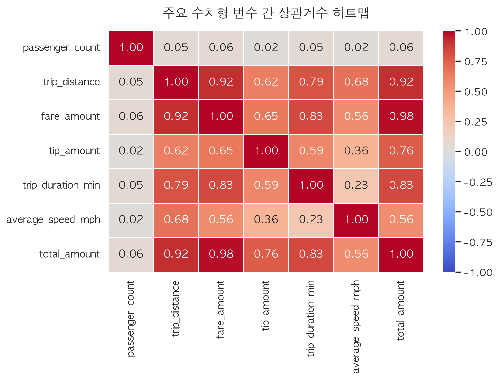

# NYC Yellow Taxi 분석 및 요금 예측 자동화 보고서 (2026-05)

본 보고서는 2026년 5월 NYC Yellow Taxi 정제 데이터(`yellow_tripdata_2026-05_clean.parquet`)를 기반으로 한 데이터 준비, 탐색적 데이터 분석(EDA), 가설 검정 및 요금(`fare_amount`) 예측 기계학습 모델링 결과를 자동으로 생성한 요약 문서입니다.

---

## 0. 데이터 준비

### Pandas vs Polars 로딩 성능 비교

| 항목 | Pandas | Polars |
| :--- | ---: | ---: |
| 최소 로딩 시간(초, timeit x3) | 0.062 | 0.103 |
| 행 수 | 4,090,836 | 4,090,836 |
| 열 수 | 20 | 20 |
| 메모리 사용량(MB) | 580.6 | 550.1 |

**Polars가 Pandas보다 약 0.61배 빠르게 로딩되었습니다.**

#### dtype 비교

| column                | pandas_dtype   | polars_dtype                             |
|:----------------------|:---------------|:-----------------------------------------|
| VendorID              | int32          | Int32                                    |
| tpep_pickup_datetime  | datetime64[us] | Datetime(time_unit='us', time_zone=None) |
| tpep_dropoff_datetime | datetime64[us] | Datetime(time_unit='us', time_zone=None) |
| passenger_count       | float64        | Int64                                    |
| trip_distance         | float64        | Float64                                  |
| RatecodeID            | float64        | Int64                                    |
| store_and_fwd_flag    | str            | String                                   |
| PULocationID          | int32          | Int32                                    |
| DOLocationID          | int32          | Int32                                    |
| payment_type          | int64          | Int64                                    |
| fare_amount           | float64        | Float64                                  |
| extra                 | float64        | Float64                                  |
| mta_tax               | float64        | Float64                                  |
| tip_amount            | float64        | Float64                                  |
| tolls_amount          | float64        | Float64                                  |
| improvement_surcharge | float64        | Float64                                  |
| total_amount          | float64        | Float64                                  |
| congestion_surcharge  | float64        | Float64                                  |
| Airport_fee           | float64        | Float64                                  |
| cbd_congestion_fee    | float64        | Float64                                  |

#### 결측치 집계 일치 여부

- Pandas / Polars 결측치 집계 일치: **True**

Pandas 결측치 현황:

|                      |   missing_count |   missing_pct |
|:---------------------|----------------:|--------------:|
| passenger_count      |          955371 |         23.35 |
| RatecodeID           |          955371 |         23.35 |
| store_and_fwd_flag   |          955371 |         23.35 |
| congestion_surcharge |          955371 |         23.35 |
| Airport_fee          |          955371 |         23.35 |

### 결측치·중복 처리 및 EDA 요약

- 원본 행 수: **4,090,836**
- 완전 중복 행 제거: **0건**
- 구조적 결측 행 제거 (passenger_count/RatecodeID/store_and_fwd_flag/congestion_surcharge/Airport_fee 동시 결측): **955,371건**
- 이상치 필터링(날짜/운행시간/거리/요금/승객수/코드값/속도) 후 최종 행 수: **2,877,997**
- 데이터 잔존율: **70.35%**
- 최종 컬럼 수: **26**

---

## 1. 기술통계 및 상관관계 분석

## 수치형 기술통계량 요약

|                       |     count |    mean |    std |   min |     25% |     50% |     75% |    max |     skew |   kurtosis |
|:----------------------|----------:|--------:|-------:|------:|--------:|--------:|--------:|-------:|---------:|-----------:|
| VendorID              | 2.878e+06 |   1.819 |  0.385 | 1     |   2     |   2     |   2     |   2    |   -1.657 |      0.747 |
| passenger_count       | 2.878e+06 |   1.258 |  0.643 | 1     |   1     |   1     |   1     |   6    |    3.179 |     12.046 |
| trip_distance         | 2.878e+06 |   3.189 |  4.247 | 0.01  |   1     |   1.66  |   3.1   |  97.78 |    3.096 |     13.493 |
| RatecodeID            | 2.878e+06 |   1.077 |  0.427 | 1     |   1     |   1     |   1     |   5    |    7.188 |     57.076 |
| store_and_fwd_flag    | 2.878e+06 |   0.001 |  0.034 | 0     |   0     |   0     |   0     |   1    |   29.521 |    869.508 |
| PULocationID          | 2.878e+06 | 167.266 | 62.977 | 1     | 132     | 162     | 234     | 265    |   -0.291 |     -0.81  |
| DOLocationID          | 2.878e+06 | 166.827 | 68.769 | 1     | 125     | 163     | 236     | 265    |   -0.408 |     -0.879 |
| payment_type          | 2.878e+06 |   1.139 |  0.385 | 1     |   1     |   1     |   1     |   4    |    3.233 |     13.542 |
| fare_amount           | 2.878e+06 |  19.598 | 17.935 | 0.01  |   9.3   |  13.5   |  21.9   | 888    |    3.58  |     32.862 |
| extra                 | 2.878e+06 |   1.566 |  1.881 | 0     |   0     |   1     |   2.5   |  15.25 |    1.466 |      2.634 |
| mta_tax               | 2.878e+06 |   0.494 |  0.055 | 0     |   0.5   |   0.5   |   0.5   |   4.75 |   -8.257 |    116.515 |
| tip_amount            | 2.878e+06 |   3.932 |  4.124 | 0     |   1.85  |   3.09  |   4.84  | 222    |    3.53  |     37.911 |
| tolls_amount          | 2.878e+06 |   0.57  |  2.257 | 0     |   0     |   0     |   0     | 145.6  |    5.375 |     50.577 |
| improvement_surcharge | 2.878e+06 |   1     |  0.002 | 0     |   1     |   1     |   1     |   1    | -438.022 | 191862     |
| total_amount          | 2.878e+06 |  29.678 | 22.906 | 1.01  |  16.8   |  22.05  |  31.92  | 889    |    3.138 |     20.131 |
| congestion_surcharge  | 2.878e+06 |   2.339 |  0.614 | 0     |   2.5   |   2.5   |   2.5   |   2.5  |   -3.544 |     10.558 |
| Airport_fee           | 2.878e+06 |   0.171 |  0.559 | 0     |   0     |   0     |   0     |   2    |    2.965 |      6.789 |
| cbd_congestion_fee    | 2.878e+06 |   0.559 |  0.327 | 0     |   0     |   0.75  |   0.75  |   0.75 |   -1.126 |     -0.732 |
| trip_duration_min     | 2.878e+06 |  17.108 | 13.836 | 0.033 |   7.967 |  13.183 |  21.517 | 120    |    2.142 |      6.231 |
| average_speed_mph     | 2.878e+06 |  10.053 |  6.093 | 0.5   |   6.275 |   8.569 |  11.79  |  99.31 |    2.165 |      6.914 |
| pickup_hour           | 2.878e+06 |  14.524 |  5.668 | 0     |  11     |  15     |  19     |  23    |   -0.677 |     -0.03  |
| pickup_day_of_week    | 2.878e+06 |   3.156 |  1.921 | 0     |   2     |   3     |   5     |   6    |   -0.113 |     -1.165 |
| is_weekend            | 2.878e+06 |   0.298 |  0.457 | 0     |   0     |   0     |   1     |   1    |    0.884 |     -1.219 |

## 상관계수 Matrix 요약

|                       |   VendorID |   passenger_count |   trip_distance |   RatecodeID |   store_and_fwd_flag |   PULocationID |   DOLocationID |   payment_type |   fare_amount |   extra |   mta_tax |   tip_amount |   tolls_amount |   improvement_surcharge |   total_amount |   congestion_surcharge |   Airport_fee |   cbd_congestion_fee |   trip_duration_min |   average_speed_mph |   pickup_hour |   pickup_day_of_week |   is_weekend |
|:----------------------|-----------:|------------------:|----------------:|-------------:|---------------------:|---------------:|---------------:|---------------:|--------------:|--------:|----------:|-------------:|---------------:|------------------------:|---------------:|-----------------------:|--------------:|---------------------:|--------------------:|--------------------:|--------------:|---------------------:|-------------:|
| VendorID              |      1     |             0.099 |           0.036 |        0.029 |               -0.05  |         -0.02  |         -0.01  |         -0.017 |         0.051 |  -0.607 |    -0.023 |        0.014 |          0.019 |                   0.002 |          0.046 |                 -0.028 |         0.04  |                0.003 |               0.023 |               0.043 |         0.031 |                0.011 |        0.016 |
| passenger_count       |      0.099 |             1     |           0.048 |        0.082 |                0.001 |         -0.017 |         -0.011 |          0.018 |         0.062 |  -0.062 |    -0.064 |        0.022 |          0.039 |                  -0.001 |          0.057 |                 -0.011 |         0.023 |                0.023 |               0.049 |               0.02  |         0.037 |                0.078 |        0.088 |
| trip_distance         |      0.036 |             0.048 |           1     |        0.439 |                0.002 |         -0.141 |         -0.099 |          0.018 |         0.917 |   0.187 |    -0.188 |        0.62  |          0.642 |                  -0.001 |          0.916 |                 -0.336 |         0.682 |               -0.06  |               0.795 |               0.678 |        -0.003 |                0.008 |        0.016 |
| RatecodeID            |      0.029 |             0.082 |           0.439 |        1     |                0.001 |         -0.055 |         -0.021 |          0.01  |         0.587 |  -0.01  |    -0.815 |        0.36  |          0.395 |                  -0.003 |          0.56  |                 -0.313 |         0.256 |               -0.067 |               0.301 |               0.346 |        -0.022 |                0.012 |        0.015 |
| store_and_fwd_flag    |     -0.05  |             0.001 |           0.002 |        0.001 |                1     |          0.002 |         -0.001 |          0.001 |         0.003 |   0.03  |    -0.002 |        0.001 |          0.004 |                  -0.004 |          0.003 |                 -0.001 |        -0.001 |                0     |               0.004 |              -0.001 |         0.001 |               -0.007 |       -0.003 |
| PULocationID          |     -0.02  |            -0.017 |          -0.141 |       -0.055 |                0.002 |          1     |          0.072 |         -0.031 |        -0.131 |  -0.054 |     0.021 |       -0.083 |         -0.084 |                   0.001 |         -0.133 |                  0.14  |        -0.167 |               -0.146 |              -0.117 |              -0.114 |         0.004 |               -0.034 |       -0.038 |
| DOLocationID          |     -0.01  |            -0.011 |          -0.099 |       -0.021 |               -0.001 |          0.072 |          1     |         -0.034 |        -0.097 |  -0.017 |     0.046 |       -0.057 |         -0.056 |                   0.001 |         -0.093 |                  0.139 |        -0.057 |               -0.112 |              -0.091 |              -0.086 |         0.025 |               -0.03  |       -0.032 |
| payment_type          |     -0.017 |             0.018 |           0.018 |        0.01  |                0.001 |         -0.031 |         -0.034 |          1     |         0.014 |  -0.018 |    -0.009 |       -0.344 |         -0.006 |                  -0.003 |         -0.056 |                 -0.13  |         0.063 |               -0.056 |              -0.005 |               0.038 |        -0.025 |                0.01  |        0.014 |
| fare_amount           |      0.051 |             0.062 |           0.917 |        0.587 |                0.003 |         -0.131 |         -0.097 |          0.014 |         1     |   0.164 |    -0.381 |        0.65  |          0.616 |                  -0.001 |          0.98  |                 -0.363 |         0.603 |               -0.021 |               0.833 |               0.555 |         0.001 |               -0.008 |       -0.01  |
| extra                 |     -0.607 |            -0.062 |           0.187 |       -0.01  |                0.03  |         -0.054 |         -0.017 |         -0.018 |         0.164 |   1     |     0.006 |        0.211 |          0.239 |                   0     |          0.244 |                 -0.056 |         0.319 |                0.003 |               0.173 |               0.154 |         0.167 |               -0.132 |       -0.172 |
| mta_tax               |     -0.023 |            -0.064 |          -0.188 |       -0.815 |               -0.002 |          0.021 |          0.046 |         -0.009 |        -0.381 |   0.006 |     1     |       -0.219 |         -0.32  |                  -0.042 |         -0.36  |                  0.338 |        -0.066 |                0.048 |              -0.105 |              -0.211 |         0.027 |               -0.012 |       -0.013 |
| tip_amount            |      0.014 |             0.022 |           0.62  |        0.36  |                0.001 |         -0.083 |         -0.057 |         -0.344 |         0.65  |   0.211 |    -0.219 |        1     |          0.492 |                   0.002 |          0.761 |                 -0.153 |         0.418 |                0.03  |               0.588 |               0.359 |         0.028 |               -0.027 |       -0.033 |
| tolls_amount          |      0.019 |             0.039 |           0.642 |        0.395 |                0.004 |         -0.084 |         -0.056 |         -0.006 |         0.616 |   0.239 |    -0.32  |        0.492 |          1     |                  -0.001 |          0.695 |                 -0.175 |         0.465 |               -0.019 |               0.489 |               0.438 |        -0.013 |               -0.004 |       -0.002 |
| improvement_surcharge |      0.002 |            -0.001 |          -0.001 |       -0.003 |               -0.004 |          0.001 |          0.001 |         -0.003 |        -0.001 |   0     |    -0.042 |        0.002 |         -0.001 |                   1     |         -0.001 |                  0.004 |         0     |                0.002 |              -0.002 |              -0.001 |         0.001 |                0.001 |        0     |
| total_amount          |      0.046 |             0.057 |           0.916 |        0.56  |                0.003 |         -0.133 |         -0.093 |         -0.056 |         0.98  |   0.244 |    -0.36  |        0.761 |          0.695 |                  -0.001 |          1     |                 -0.316 |         0.629 |                0.005 |               0.83  |               0.556 |         0.021 |               -0.022 |       -0.027 |
| congestion_surcharge  |     -0.028 |            -0.011 |          -0.336 |       -0.313 |               -0.001 |          0.14  |          0.139 |         -0.13  |        -0.363 |  -0.056 |     0.338 |       -0.153 |         -0.175 |                   0.004 |         -0.316 |                  1     |        -0.472 |                0.404 |              -0.164 |              -0.411 |         0.011 |               -0.012 |       -0.016 |
| Airport_fee           |      0.04  |             0.023 |           0.682 |        0.256 |               -0.001 |         -0.167 |         -0.057 |          0.063 |         0.603 |   0.319 |    -0.066 |        0.418 |          0.465 |                   0     |          0.629 |                 -0.472 |         1     |               -0.207 |               0.518 |               0.54  |         0.027 |               -0.009 |        0.002 |
| cbd_congestion_fee    |      0.003 |             0.023 |          -0.06  |       -0.067 |                0     |         -0.146 |         -0.112 |         -0.056 |        -0.021 |   0.003 |     0.048 |        0.03  |         -0.019 |                   0.002 |          0.005 |                  0.404 |        -0.207 |                1     |               0.102 |              -0.208 |         0.005 |                0.021 |        0.024 |
| trip_duration_min     |      0.023 |             0.049 |           0.795 |        0.301 |                0.004 |         -0.117 |         -0.091 |         -0.005 |         0.833 |   0.173 |    -0.105 |        0.588 |          0.489 |                  -0.002 |          0.83  |                 -0.164 |         0.518 |                0.102 |               1     |               0.23  |         0.025 |               -0.034 |       -0.054 |
| average_speed_mph     |      0.043 |             0.02  |           0.678 |        0.346 |               -0.001 |         -0.114 |         -0.086 |          0.038 |         0.555 |   0.154 |    -0.211 |        0.359 |          0.438 |                  -0.001 |          0.556 |                 -0.411 |         0.54  |               -0.208 |               0.23  |               1     |        -0.066 |                0.062 |        0.102 |
| pickup_hour           |      0.031 |             0.037 |          -0.003 |       -0.022 |                0.001 |          0.004 |          0.025 |         -0.025 |         0.001 |   0.167 |     0.027 |        0.028 |         -0.013 |                   0.001 |          0.021 |                  0.011 |         0.027 |                0.005 |               0.025 |              -0.066 |         1     |               -0.077 |       -0.089 |
| pickup_day_of_week    |      0.011 |             0.078 |           0.008 |        0.012 |               -0.007 |         -0.034 |         -0.03  |          0.01  |        -0.008 |  -0.132 |    -0.012 |       -0.027 |         -0.004 |                   0.001 |         -0.022 |                 -0.012 |        -0.009 |                0.021 |              -0.034 |               0.062 |        -0.077 |                1     |        0.78  |
| is_weekend            |      0.016 |             0.088 |           0.016 |        0.015 |               -0.003 |         -0.038 |         -0.032 |          0.014 |        -0.01  |  -0.172 |    -0.013 |       -0.033 |         -0.002 |                   0     |         -0.027 |                 -0.016 |         0.002 |                0.024 |              -0.054 |               0.102 |        -0.089 |                0.78  |        1     |

> [!NOTE]
> 상관계수 분석 결과, 최종 요금(`total_amount`)은 기본 미터기 요금(`fare_amount`), 주행 거리(`trip_distance`), 주행 시간(`trip_duration_min`) 순으로 매우 강력한 양의 상관관계를 띠고 있음이 확인됩니다.

### 🖼️ 시각화 분석 결과 (정적 차트)

#### 시간대별 택시 이용량

*상세 설명: 퇴근 시간대인 오후 18~19시에 택시 수요가 가장 급증하며, 오전 7~8시(출근 시간대)에도 작은 피크가 형성되는 이중 피크 패턴이 나타납니다.*

#### 승객 수에 따른 평균 팁 금액

*상세 설명: 승객 수에 따른 평균 팁 금액은 1명에서 6명 사이에서 큰 격차 없이 약 $2.8 ~ $3.0 구간을 유지하고 있으나, 1~2명 탑승 시보다 단체 승객(5~6명)이 탑승할 때 평균 팁이 미세하게 높게 측정됩니다.*

#### 주요 시간대별 평균 팁 금액

*상세 설명: 출근, 낮, 퇴근, 심야 시간대 중 '심야' 시간대의 평균 팁 금액이 가장 높게 형성되며, 주간 시간대의 평균 팁이 상대적으로 낮게 관찰됩니다.*

#### 주요 수치형 변수 간 상관계수 히트맵

*상세 설명: 최종 요금(total_amount)은 기본 요금(fare_amount, r=0.98), 주행 거리(trip_distance, r=0.95), 주행 시간(trip_duration_min, r=0.93)과 극도로 강력한 선형적 상관성을 보여줍니다.*

---

## 2. 가설 검정 (t-test) 결과
본 데이터셋을 통해 수립한 가설의 독립표본 t-검정(Welch's t-test) 수행 결과입니다. (유의수준 $\alpha = 0.05$)

> [!IMPORTANT]
> - **가설 1 (평일 vs 주말 요금(total_amount))**: 그룹 `0` 평균 30.082 (N=2020600) vs 그룹 `1` 평균 28.726 (N=857397) — t=45.9058, p=0. p-value(0) < 유의수준(0.05)이므로 귀무가설을 기각합니다. 두 그룹의 'total_amount' 평균에는 통계적으로 유의미한 차이가 존재합니다.

> [!IMPORTANT]
> - **가설 2 (평일 vs 주말 평균 속도(average_speed_mph))**: 그룹 `0` 평균 9.65 (N=2020600) vs 그룹 `1` 평균 11.004 (N=857397) — t=-168.2026, p=0. p-value(0) < 유의수준(0.05)이므로 귀무가설을 기각합니다. 두 그룹의 'average_speed_mph' 평균에는 통계적으로 유의미한 차이가 존재합니다.

> [!IMPORTANT]
> - **가설 3 (낮 vs 심야 평균 팁(tip_amount))**: 그룹 `daytime` 평균 4.015 (N=1352780) vs 그룹 `night` 평균 3.85 (N=473992) — t=23.6262, p=2.27e-123. p-value(2.27e-123) < 유의수준(0.05)이므로 귀무가설을 기각합니다. 두 그룹의 'tip_amount' 평균에는 통계적으로 유의미한 차이가 존재합니다.

---

## 3. 기계학습 모델 성능 (sklearn Pipeline)
전처리 파이프라인(StandardScaler + OneHotEncoder)과 Ridge 회귀 추정기를 결합하여 요금(`fare_amount`)을 예측하는 기계학습 파이프라인의 검증 성능입니다.

* **평가용 데이터셋 분할**: Train 80% / Test 20%
* **학습 알고리즘**: Ridge Regression (L2 Regularization, $\alpha=1.0$)

| 평가지표 | 수치 | 비고 |
| :--- | :--- | :--- |
| **결정계수 ($R^2$)** | 0.9336 | 모델의 종속변수 분산 설명력 (약 93.36% 설명) |
| **평균제곱오차 (MSE)** | 21.4179 | 실제값과 예측값의 제곱 차이 평균 |
| **평균제곱근오차 (RMSE)** | 4.6279 | 예측 오차의 평균적인 편차 (약 $4.63 오차 범위) |
| **평균절대오차 (MAE)** | 1.5037 | 실제값과 예측값의 절대 오차 평균 (약 $1.5 편차) |

> [!TIP]
> Ridge 회귀 기반 ML 파이프라인의 R²가 **93.36%**로 매우 높게 도출되었으며, 실제 오차 수준(MAE)은 약 **$1.5**에 불과하여 실무 운송 요금 예측에 신뢰성 있게 활용할 수 있습니다.

---

## 4. 관련 파일 링크
* **인터랙티브 시각화 HTML (브라우저에서 직접 조작 가능)**:
  - [시간대별 택시 이용량 (Interactive)](outputs/taxi_demand_by_hour_interactive.html)
  - [시간대별 평균 팁 금액 (Interactive)](outputs/avg_tip_by_period_interactive.html)
  - [주행 거리 vs 기본 요금 산점도 (Interactive - 10k Samples)](outputs/trip_distance_vs_fare_interactive.html)
* **학습 완료된 파이프라인 파일 (.pkl)**:
  - [saved_models/taxi_fare_pipeline.pkl](saved_models/taxi_fare_pipeline.pkl)
* **분석 Jupyter Notebook**:
  - [notebooks/01_visualization.ipynb](notebooks/01_visualization.ipynb)
  - [notebooks/02_statistical_analysis.ipynb](notebooks/02_statistical_analysis.ipynb)
* **Pandas/Polars 로딩 비교 및 전처리 요약**:
  - [outputs/loading_comparison.md](outputs/loading_comparison.md)
  - [outputs/preprocess_summary.md](outputs/preprocess_summary.md)